# Steam Deck Tips and Tricks!

I'm compiling here Steam Deck quality of life improvements and tricks that will make working with it smoother and a more comfy place to work in.

## Contents

- [Install packages into the rootfs using pacman](#install-packages-into-the-rootfs-using-pacman)
- [Easy SSH access to the Steam Deck](#easy-ssh-access-to-the-steam-deck)
  - [On the Steam Deck](#on-the-steam-deck)
  - [On your computer](#on-your-computer)
- [Disable powersave on wlan0 for snappier remote command](#disable-powersave-on-wlan0-for-snappier-remote-command)
- [Add konsole (terminal) to Steam Deck UI](#add-konsole-terminal-to-steam-deck-ui)
- [Encrypted Vaults with Plasma Vault and gocryptfs](#encrypted-vaults-with-plasma-vault-and-gocryptfs)
  - [Browser profile or any config folder inside an encrypted Vault](#browser-profile-or-any-config-folder-inside-an-encrypted-vault)
  - [Unlock Plasma Vaults from the Steam Deck UI](#unlock-plasma-vaults-from-the-steam-deck-ui)
- [Shared keyboard, mouse and clipboard with barrier](#shared-keyboard-mouse-and-clipboard-with-barrier)
  - [On the main computer](#on-the-main-computer)
  - [On the Steam Deck](#on-the-steam-deck)
- [auto-cpufreq](#auto-cpufreq)
  - [Low performance in games on battery](#low-performance-in-games-on-battery)
- [Wireguard](#wireguard)
- [Use podman to create a SteamOS/Arch development image](#use-podman-to-create-a-steamosarch-development-image)
- [Create a SteamOS/Arch development root in your home folder](#create-a-steamosarch-development-root-in-your-home-folder)
- [Use your smartphone as webcam via Droidcam](#use-your-smartphone-as-webcam-via-droidcam)
  - [AppImage](#appimage)
  - [Manually](#manually)
- [Android via Waydroid](#android-via-waydroid)
- [Convert the home partition to Btrfs](#convert-the-home-partition-to-btrfs)
- [Gamescope fps limiter not working on flatpaks](#gamescope-fps-limiter-not-working-on-flatpaks)
  - [Flatseal](#flatseal)
  - [Bottles](#bottles)
- [Toggle internal display via hotkeys](#toggle-internal-display-via-hotkeys)

---

## Install packages into the rootfs using pacman

To install system packages you'll need to make the rootfs read-write and set up the keyrings first.

**Anything you install this way will disappear after a system update or branch change. (But it's easy enough to reinstall them)**

**BUT**, files installed into specifc locations will remain because they are offloaded onto your `/home` partition or the separate `/var` partition:
- `/etc`
- `/opt`
- `/root`
- `/srv`
- (and a few specific ones in `/var`: `/var/cache/pacman`, `/var/lib/docker`, `/var/lib/flatpak`, `/var/lib/systemd/coredump`, `/var/log`, `/var/tmp`)

Concerning the arch repos maintained by Valve, the package versions seem to be pinned to a fixed target which means the packages are not rolling as much as on pure arch (like `glibc` being at 2.33 instead of 2.35 in the normal arch repos).
The ota updater of SteamOS is the one supposed to roll the whole system to a newer target safely. That's why in my guides about installing software through `pacman` I'm somewhat going against Arch's mantra about [Partial upgrades being unsupported](https://wiki.archlinux.org/title/System_maintenance#Partial_upgrades_are_unsupported) and invoking `pacman` with `-Sy` without `-u`. The `-y` is present to make sure the missing package databases are synced but having `-u` might potentially pull in upgrades for system libraries that should preferably be updated during an ota update. So the worst case scenario in this instance would be that the package you just installed does not work which is preferable to potentially going through a full upgrade leaving the system in a weird state. For "simple" packages (like ones that do not have many dependencies) this should be ok but more complex packages might need a full upgrade `-u` nonetheless.

```sh
sudo steamos-readonly disable
sudo pacman-key --init
sudo pacman-key --populate archlinux
sudo pacman-key --populate holo
sudo pacman -Sy <packagetoinstall>
sudo steamos-readonly enable
```

## Easy SSH access to the Steam Deck

### On the Steam Deck

In desktop mode, set a password for your user

```sh
passwd
```

Enable and start the ssh server

```sh
sudo systemctl enable --now sshd.service
```

Remember the ip address of the Steam Deck
```sh
ip addr
```

### On your computer

Generate a new keypair
```sh
ssh-keygen -t ed25519 -f ~/.ssh/steamdeck_ed25519
```
(replace `<ip>` with the ip of the Steam Deck)

Copy the public key over to the Steam Deck (will ask for the password of user deck)
```sh
ssh-copy-id -i ~/.ssh/steamdeck_ed25519.pub deck@<ip>
```

Create a configuration for the Steam Deck, create `~/.ssh/config` and add:
```
Host steamdeck
  HostName <ip>
  IdentityFile ~/.ssh/steamdeck_ed25519
  User deck
```

Now you can simply connect with
```sh
ssh steamdeck
```

On the Steam Deck you can disable password authentication:

Open `/etc/ssh/sshd_config` and find:
```
#PasswordAuthentication yes
```
and change to
```
PasswordAuthentication no
```
Reload sshd
```sh
sudo systemctl reload sshd.service
```

## Disable powersave on wlan0 for snappier remote command

If ssh or barrier is lagging

```sh
sudo iw dev wlan0 set power_save off
```

## Add konsole (terminal) to Steam Deck UI

It can be practical to have konsole directly accessible from the Steam Deck UI

Add non-steam game to Steam in Desktop mode, select konsole and add as launch options:

```
--fullscreen --notransparency
```

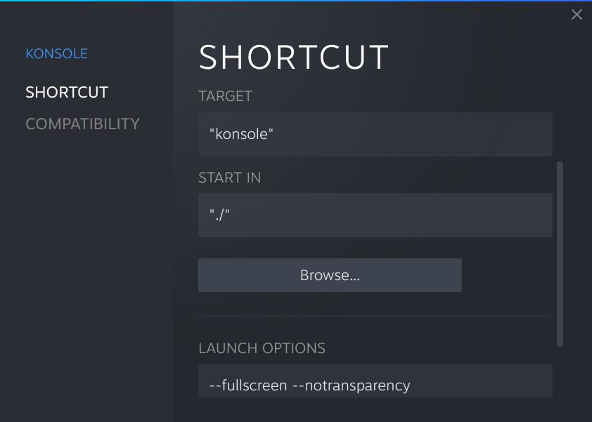

This should make it work correctly inside gamescope.
For the controller layout make sure to select the **Web Browser** Template.

If you get `LD_PRELOAD` logs or obnoxious `pid XXXX != XXXX, skipping destruction (fork without exec?)` lines between the commands you execute,  you can do the following:
- In the `Target` of the `konsole` shortcut set: `env`
- In the `Launch options` set: `-u LD_PRELOAD konsole --fullscreen --notransparency`
- Enjoy a clean terminal!

## Encrypted Vaults with Plasma Vault and gocryptfs

Plasma Vault is a handy way to quickly create and manage encrypted folder embedded into the desktop environment.

Vaults might be hidden by default under Status and notifications visible by clicking the up arrow left to the date and time.

You can choose between **CryFS**, **EncFS** and **gocryptfs** crypto backend. My preferred is gocryptfs: https://wiki.archlinux.org/title/Gocryptfs

To add gocryptfs support:

```sh
sudo pacman --cachedir /tmp -Sw --noconfirm gocryptfs
mkdir -p ~/.local/bin
tar -xf /tmp/gocryptfs-*.pkg.tar.zst -C ~/.local/bin --strip-components=2 usr/bin
sudo rm -f /tmp/gocryptfs*.pkg.*
mkdir -p ~/.config/environment.d
echo 'PATH="$PATH:$HOME/.local/bin"' >> ~/.config/environment.d/envvars.conf
echo 'export PATH="$PATH:$HOME/.local/bin"' >> ~/.bash_profile
```

Logout and back in for Plasma Vaults to pick up gocryptfs.
You can now create encrypted Vaults with the gocryptfs backend.

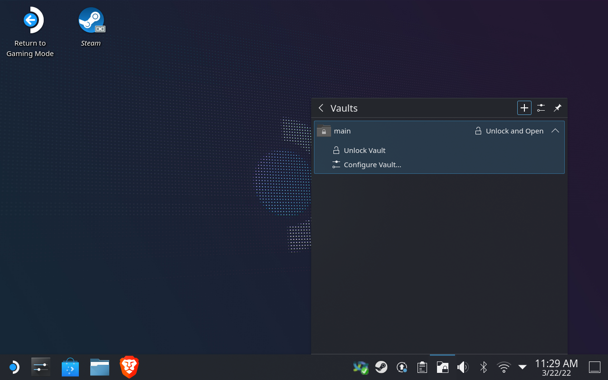

### Browser profile or any config folder inside an encrypted Vault

It is more secure to store the browser profile in an encrypted Vault in case of theft or unauthorised access to the Steam Deck.

*The following uses brave as example but you can apply it to any app where you can identify the config path and move it into the encrypted vault.*

* We assume we have a plasma Vault called `main` located and unlocked at `~/Vaults/main`
* The flatpak version of Brave stores the user profile at `~/.var/app/com.brave.Browser/config/BraveSoftware`

- Close Brave if it's running
- Unlock the Vault
- Copy the user profile to the Vault
  + `cp -a ~/.var/app/com.brave.Browser/config/BraveSoftware ~/Vaults/main/`
- Remove the unencrypted profile and create a symlink to the encrypted profile
  + `rm -rf ~/.var/app/com.brave.Browser/config/BraveSoftware`
  + `ln -s ../../../../Vaults/main/BraveSoftware ~/.var/app/com.brave.Browser/config/BraveSoftware`
- Add the new location as allowed path to Brave flatpak using flatseal
  + Install **flatseal** from Discover and open it
  + Select **Brave Browser (com.brave.Browser)**
  + Under Filesystem > Other files add `~/Vaults/main/BraveSoftware`
- Now all user data will be stored encrypted and Brave will only launch if the Vault is unlocked!

Another popular example is Discord:
- The user profile is located at `~/.var/app/com.discordapp.Discord/config/discord`
- `cp -a ~/.var/app/com.discordapp.Discord/config/discord ~/Vaults/main/`
- `rm -rf ~/.var/app/com.discordapp.Discord/config/discord`
- `ln -s ../../../../Vaults/main/discord ~/.var/app/com.discordapp.Discord/config/discord`
- in **flatseal** add `~/Vaults/main/discord` under Filesystem > Other files

### Unlock Plasma Vaults from the Steam Deck UI

If you store your sensitive data and profiles inside Plasma Vaults, it might be practical to have a way to unlock them from the Steam Deck UI.

* Create `~/.config/systemd/user/plasma-vault@.service`:<br>
<sub>(`mkdir -p ~/.config/systemd/user ; vim ~/.config/systemd/user/plasma-vault@.service`)</sub>

```ini
[Unit]
Description=Mount plasma Vault %I
DefaultDependencies=no
Conflicts=umount.target
Before=umount.target

[Service]
Type=forking
ExecStartPre=-rm -f /tmp/plasma-vault-pass-%i
ExecStartPre=mkfifo /tmp/plasma-vault-pass-%i
ExecStart="%h/.local/bin/gocryptfs" -idle 5m --extpass "head -n 1 /tmp/plasma-vault-pass-%i" "%h/.local/share/plasma-vault/%I.enc" "%h/Vaults/%I"
ExecStartPost=-rm -f /tmp/plasma-vault-pass-%i
```
The systemd user service will handle the mounting of the encrypted folder in the user sessions.

You can set the idle time to lock to whatever you prefer.

Reload the systemd user daemon:
```sh
systemctl --user daemon-reload
```

* Create `~/.local/bin/vault-handler`:<br>
<sub>(`mkdir -p ~/.local/bin ; vim ~/.local/bin/vault-handler`)</sub>

```sh
#!/bin/sh
VAULT_NAME="$1"
VAULT_NAME_ESC="$(systemd-escape "$VAULT_NAME")"
mountpoint -q "$HOME/Vaults/$VAULT_NAME" && exit 0
PASS_FIFO="/tmp/plasma-vault-pass-${VAULT_NAME_ESC}"
for _ in $(seq 3)
do
        systemctl --user --no-block start plasma-vault@"$VAULT_NAME_ESC"
        sleep 1
        ksshaskpass "Unlock plasma Vault '$VAULT_NAME'" > "$PASS_FIFO" || exit 0
        sleep 1
        systemctl --user --quiet is-active plasma-vault@"$VAULT_NAME_ESC" && break
done
```
Make it executable:
```sh
chmod +x ~/.local/bin/vault-handler
```
This will use `ksshaskpass` as graphical password prompt to unlock the vault.

* Add `vault-handler` to Steam as Non-Steam game and in the launch options set the name of your vault to unlock (e.g.: `main`)

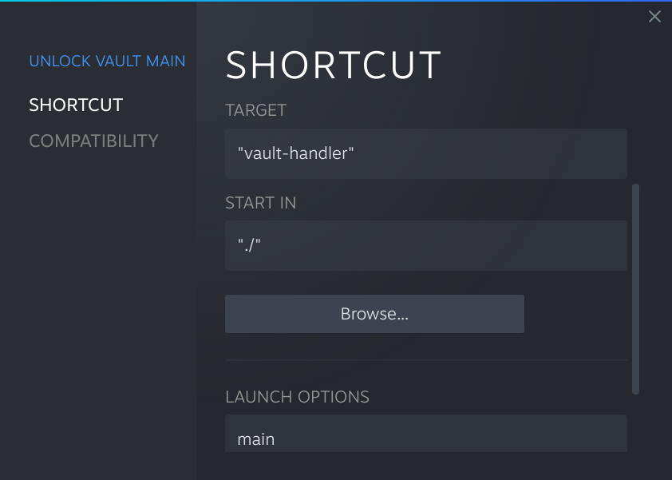

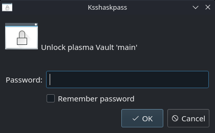

## Shared keyboard, mouse and clipboard with barrier

[barrier](https://wiki.archlinux.org/title/Barrier) is a fork of synergy which makes it possible to share keyboard, mouse and clipboard of one computer with another over the network.

Install barrier from Discovery on the computer and the Steam Deck.

### On the main computer
- Choose Server
- Configure Server... gives you a visual representation of relative position the computers should have
- Double click on the position relative to the main computer you want to position your Steam Deck
- As Screen name set `steamdeck` or the hostname you have set for your Steam Deck
- Start server
- Make sure port **24800** tcp is open if a firewall is configured

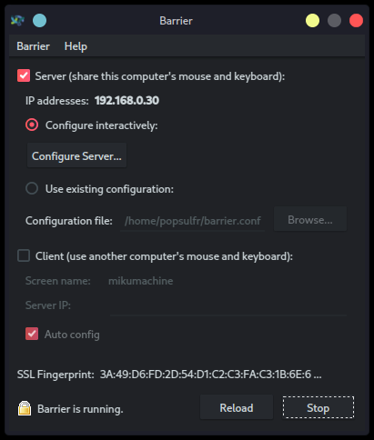

### On the Steam Deck
- Choose Client
- Auto config should work otherwise input the ip address of the main computer
- Make the client hide on startup: Barrier > Change Settings > Hide on startup
- Set barrier to autostart when Desktop mode is active:
  + System Settings > Startup and Shutdown > Autostart > + Add > + Add Application... > Utilities > Barrier

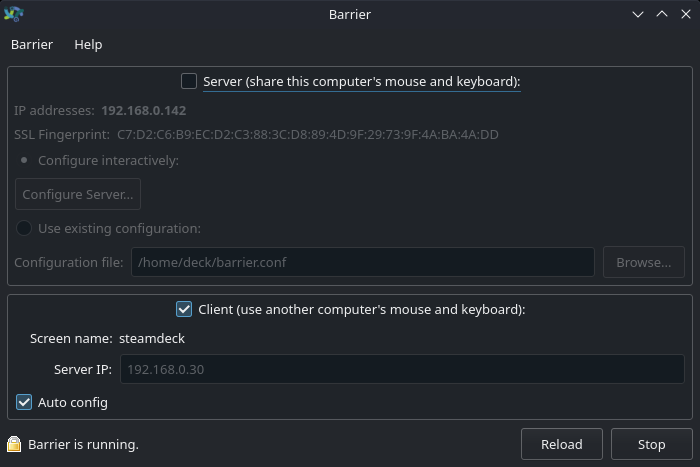

You should be good to go!

## auto-cpufreq

Automatically optimize cpu speed and power with auto-cpufreq: https://github.com/AdnanHodzic/auto-cpufreq

It remains to be seen if it really helps or does something on the Steam Deck.

The following steps will install auto-cpufreq into the home directory.

<sub>(Build steps taken from the AUR PKGBUILD: https://aur.archlinux.org/cgit/aur.git/tree/PKGBUILD?h=auto-cpufreq)</sub>

```sh
curl https://github.com/AdnanHodzic/auto-cpufreq/archive/refs/tags/v1.9.3.tar.gz | tar -xzf -
cd auto-cpufreq-*
mkdir -p "$HOME/.local"
ln -s . "$HOME/.local/usr"
python -m ensurepip --upgrade
python -m pip install --upgrade pip
python -m pip install distro
sed -i 's|^\([^#].*\)/usr/\(local/\)\?|\1'"$HOME"'/.local/|g' auto_cpufreq/core.py
python setup.py build
python setup.py install --root="$HOME/.local" --optimize=1 --skip-build
install -Dm755 scripts/cpufreqctl.sh -t "$HOME/.local/share/auto-cpufreq/scripts"
```

Add `export PATH="$PATH:$HOME/.local/bin"` to your `~/.bash_profile`.

Create a systemd user service that will activate auto-cpufreq: `~/.config/systemd/user/auto-cpufreq.service`

<sub>(`mkdir -p ~/.config/systemd/user ; vim ~/.config/systemd/user/auto-cpufreq.service`)</sub>
```ini
[Unit]
Description=auto-cpufreq - Automatic CPU speed & power optimizer for Linux

[Service]
Type=simple
ExecStart=sudo -E -n -- "%h/.local/bin/auto-cpufreq" --daemon
Restart=on-failure

[Install]
WantedBy=default.target
```

Make sure there's a `~/.config/environment.d/envvars.conf` with `PATH="$PATH:$HOME/.local/bin"` in it.

Add a sudoers rule to launch auto-cpufreq without password (`/etc/sudoers.d/zzz-auto-cpufreq`)
```sh
echo "$USER ALL=(ALL) NOPASSWD:SETENV: $HOME/.local/bin/auto-cpufreq *" | sudo tee -a /etc/sudoers.d/zzz-auto-cpufreq
sudo chmod 0440 /etc/sudoers.d/zzz-auto-cpufreq
```

Reload the user daemon
```sh
systemctl --user daemon-reload
```

You can enable auto-cpufreq to start on every boot:
```sh
systemctl --user enable --now auto-cpufreq.service
```

You can monitor the stats:
```sh
auto-cpufreq --stats
```

### Low performance in games on battery

By default when the device is not charging auto-cpufreq will switch to the `powersave` cpu governor which might affect games' performance.

You can force it to use the default `schedutil` for both charging and on battery.

Create `~/.config/auto-cpufreq.conf`:

```ini
[charger]
governor = schedutil

[battery]
governor = schedutil
```

Change the service file `~/.config/systemd/user/auto-cpufreq.service`:
```ini
[Unit]
Description=auto-cpufreq - Automatic CPU speed & power optimizer for Linux

[Service]
Type=simple
ExecStart=sudo -E -n -- "%h/.local/bin/auto-cpufreq" --daemon --config "%h/.config/auto-cpufreq.conf"
Restart=on-failure

[Install]
WantedBy=default.target
```

Reload user daemon
```sh
systemctl --user daemon-reload
```

Restart the service
```sh
systemctl --user restart auto-cpufreq.service
```

## Wireguard

You can install the wireguard tools locally like this:

```sh
sudo pacman --cachedir /tmp -Sw --noconfirm wireguard-tools
mkdir -p ~/.local/bin
tar -xf /tmp/wireguard-tools-*.pkg.tar.zst -C ~/.local/bin --strip-components=2 usr/bin
sudo rm -f /tmp/wireguard-tools*.pkg.*
```

Make sure there is a `export PATH="$PATH:$HOME/.local/bin"` in your `~/.bash_profile`.

You can create `/etc/wireguard` and copy you wireguard configs there.

```sh
wg-quick up <wgconf>
```

Network Manager also has wireguard support.

Helper script for creating a separate network namespace for your applications with a wireguard connection.

Save it as `~/.local/bin/wg-netns` and make it executable.

<sub>(`vim ~/.local/bin/wg-netns ; chmod +x ~/.local/bin/wg-netns`)</sub>

```bash
#!/usr/bin/env bash
IFS=$'\n'
set -euo pipefail
set -x

export WG_ENDPOINT_RESOLUTION_RETRIES=infinity

WGCONF="$(sudo -u "${SUDO_USER:-${USER}}" -- cat "$2")"
WGDEV="$(basename "$2" .conf)"
WGPK="/tmp/$WGDEV-pk"

val_parse() {
	sed -n 's/^'"$1"'\s*=\s*\(\S\+\)\s*$/\1/p' <<<"$WGCONF"
}
arr_parse() {
	sed -n 's/^'"$1"'\s*=\s*\(\S.*\S\)\s*$/\1/p' <<<"$WGCONF" | sed 's/\s*,\s*/\n/g'
}

PrivateKey="$(val_parse PrivateKey)"
ListenPort="$(val_parse ListenPort)"
FwMark="$(val_parse FwMark)"
PublicKey="$(val_parse PublicKey)"
PresharedKey="$(val_parse PresharedKey)"
AllowedIPs=($(arr_parse AllowedIPs))
Endpoint="$(val_parse Endpoint)"
PersistentKeepalive="$(val_parse PersistentKeepalive)"
Addresses=($(arr_parse Address))
DNS=($(arr_parse DNS))
MTU="$(val_parse MTU)"

wg_set_opts=()
[[ -n "$ListenPort" ]] && wg_set_opts+=(listen-port "$ListenPort")
[[ -n "$FwMark" ]] && wg_set_opts+=(fwmark "$FwMark")
[[ -n "$PrivateKey" ]] && wg_set_opts+=(private-key "$WGPK")
[[ -n "$PublicKey" ]] && wg_set_opts+=(peer "$PublicKey")
[[ -n "$PresharedKey" ]] && wg_set_opts+=(preshared-key "$PresharedKey")
[[ -n "$Endpoint" ]] && wg_set_opts+=(endpoint "$Endpoint")
[[ -n "$PersistentKeepalive" ]] && wg_set_opts+=(persistent-keepalive "$PersistentKeepalive")
[[ "${#AllowedIPs[@]}" -gt 0 ]] && wg_set_opts+=(allowed-ips "$(IFS=, ; echo "${AllowedIPs[*]}")")

if [[ "$1" == "up" ]]
then
	ip netns del "$WGDEV" &>/dev/null || true
	ip netns add "$WGDEV"
	ip -n "$WGDEV" link set lo up
	ip link add dev "$WGDEV" type wireguard
	ip link set "$WGDEV" netns "$WGDEV"
	rm -f "$WGPK"
	mkfifo -m 0600 "$WGPK"
	echo "$PrivateKey" > "$WGPK" &
	ip netns exec "$WGDEV" wg set "$WGDEV" "${wg_set_opts[@]}"
	rm -f "$WGPK"
	for a in "${Addresses[@]}" ; do ip -n "$WGDEV" addr add "$a" dev "$WGDEV" ; done
	if [[ "${#DNS[@]}" -gt 0 ]]
	then
		mkdir -p "/etc/netns/$WGDEV"
		truncate -s 0 "/etc/netns/$WGDEV/resolv.conf"
		for d in "${DNS[@]}" ; do echo "nameserver $d" >> "/etc/netns/$WGDEV/resolv.conf" ; done
		echo 'options edns0 single-request-reopen' >> "/etc/netns/$WGDEV/resolv.conf"
	fi
	[[ -n "$MTU" ]] && ip -n "$WGDEV" link set "$WGDEV" mtu "$MTU"
	ip -n "$WGDEV" link set "$WGDEV" up
	for a in "${AllowedIPs[@]}" ; do ip -n "$WGDEV" route add "$a" dev "$WGDEV" ; done
elif [[ "$1" == "down" ]]
then
	ip netns del "$WGDEV" || true
	rm -f "/etc/netns/$WGDEV/resolv.conf" || true
	rmdir "/etc/netns/$WGDEV" || true
elif [[ "$1" == "exec" ]]
then
	shift 2
	exec sudo -E -- ip netns exec "$WGDEV" sudo -E -u "${SUDO_USER:-${USER}}" -- "$@"
fi

```

```sh
# Bring up wireguard conf in a network namespace of the same name
sudo wg-netns up <path/to/wgconf>
# Bring down network namespace
sudo wg-netns down <path/to/wgconf>
# Execute a command inside the network namespace
wg-netns exec <path/to/wgconf> firefox
# Join a network namespace using firejail
firejail --noprofile --netns=<wgconfname> firejail
```

**I found a bug when using an ipv6 endpoint as soon as packets were sent, it would freeze the whole system and force a reboot after some time. Use an ipv4 endpoint for now. (last checked on kernel `5.13.0-valve10.3-1-neptune-02176-g5fe416c4acd8`)**

## Use podman to create a SteamOS/Arch development image

You can get a portable AppImage of podman which works on SteamOS here: https://github.com/popsUlfr/podman-appimage/releases

It should make getting a development root much easier and robust and you can then make use of all the existing container images out there to get all sorts of software running.

Once you downloaded the `podman-*.AppImage` there are various ways to launch it:

### **A.**

* In **Dolphin**
* Right-click the **AppImage** > **Properties** > **Permissions** > Check **Is executable** > Click **OK**
* Right-click the **AppImage** > **Run In Konsole**

### **B.**

* Open **Konsole**
* Navigate (`cd`) to the folder where the **AppImage** is stored
* `chmod +x podman-*.AppImage`
* `./podman-*.AppImage`

### **C.**

* In **Dolphin**
* Right-click the folder where the **AppImage** is stored > **Open Terminal** / or hit **Shift+F4**
* `chmod +x podman-*.AppImage`
* `./podman-*.AppImage`

It will most likely prompt you to fix some things to get the rootless mode working, so make sure you set your user up with a password using `passwd` beforehand.

It will open a `podman-shell` that gives you access to the various **podman** commands, see: https://docs.podman.io/en/latest/Commands.html

You can also rename the **AppImage** or create a symlink to access a contained binary directly:

```sh
ln -s podman-*.AppImage podman
./podman info
ln -s podman-*.AppImage podman-remote
./podman-remote --url='ssh://root@localhost:22/run/podman/podman.sock' info
```

**The awesome people over at [SteamDeckHomebrew](https://github.com/SteamDeckHomebrew) have already prepared docker images with rust, go toolchains and an accurate SteamOS holo image: https://github.com/orgs/SteamDeckHomebrew/packages?repo_name=holo-docker**

```sh
./podman-*.AppImage
(deck@podman-shell:~) $ podman pull ghcr.io/steamdeckhomebrew/holo-base:latest
(deck@podman-shell:~) $ podman run -ti holo-base:latest /bin/bash
(root@<id> /)#
```
With this you should be good to go with your development needs on the Steam Deck.

**Here's a manual way to get SteamOS image using the archlinux image as base:**

```sh
./podman-*.AppImage
(deck@podman-shell:~) $ podman pull archlinux:latest
(deck@podman-shell:~) $ podman run -ti archlinux:latest
[root@<id> /]# echo 'Server = https://steamdeck-packages.steamos.cloud/archlinux-mirror/$repo/os/$arch' > /etc/pacman.d/mirrorlist
[root@<id> /]# sed -i 's|^\(\[core\]\)|[jupiter]\nInclude = /etc/pacman.d/mirrorlist\nSigLevel = Never\n\n[holo]\nInclude = /etc/pacman.d/mirrorlist\nSigLevel = Never\n\n\1|' /etc/pacman.conf
[root@<id> /]# pacman -Syy
[root@<id> /]# pacman-key --init
[root@<id> /]# pacman-key --populate archlinux
[root@<id> /]# pacman -S holo-keyring
[root@<id> /]# pacman -Rdd --noconfirm libverto
[root@<id> /]# pacman -Qqn | pacman -S --noconfirm --overwrite='*' -
[root@<id> /]# pacman -S --noconfirm --needed base-devel git sudo
[root@<id> /]# rm -rf /var/cache/pacman/pkg/*
[root@<id> /]# useradd -m deck
[root@<id> /]# echo 'deck ALL=(ALL) NOPASSWD: ALL' > /etc/sudoers.d/deck
```

This replaces all Arch packages with the SteamOS' mirror versions and installs development packages.
Finally an unprivileged `deck` user is created.

You can be come this user immediately with:

```sh
[root@<id> /]# su - deck
[deck@<id> /]$
```

And `sudo` is set up to do tasks as root.

You can exit the container:
```sh
[root@<id> /]# exit
```

Now create a new image from this container:

Query the container id with:
```sh
(deck@podman-shell:~) $ podman ps -a
```
```
CONTAINER ID  IMAGE                                 COMMAND        CREATED         STATUS                    PORTS       NAMES
<id>          docker.io/archlinux/archlinux:latest  /usr/bin/bash  29 minutes ago  Exited (0) 2 minutes ago              <name>
```

You can either use the `<id>` or the `<name>` to target a container. Now commit the container to a new image:
```sh
(deck@podman-shell:~) $ podman commit -s <id> holo:latest
```

This creates a new squashed image called `holo` with tag `latest` which you can see with `podman images`.

Now you can run it like any image:
```sh
(deck@podman-shell:~) $ podman run -ti holo:latest
```
Mount the current directory at `/tmp/out` in the image:
```sh
(deck@podman-shell:~) $ podman run -v ./:/tmp/out -ti holo:latest
```
Become immediately the `deck` user:
```sh
(deck@podman-shell:~) $ podman run -v ./:/tmp/out -u deck -ti holo:latest
```

You can also resume a stopped container at any moment without needing to commit a new image:
```sh
(deck@podman-shell:~) $ podman start -ai <id>
```

## Create a SteamOS/Arch development root in your home folder

**DISCLAIMER: the following section describes the hard manual way to get a fake root.**

**Check out [Use podman to create a SteamOS/Arch development image](#use-podman-to-create-a-steamosarch-development-image) instead for an easier and more flexible solution using podman.**

To install software beyond flatpaks, AppImages like system packages it is practical to create a custom rootfs to build new software.

The main rootfs already uses arch but it's not a good idea and doesn't work very well to use it to install missing system development tools and headers that are needed for building some packages.

For this we'll be using two main tools and avoid using any root privileges at all: `fakeroot` and `bwrap` (bubblewrap).
- `fakeroot` for faking root root privileges
- `bwrap` for changing the rootfs and using a separate user namespace

We fetch `fakeroot` and put it into our local folders:

```sh
mkdir -p ~/.local/bin
sudo pacman --cachedir /tmp -Sw --noconfirm fakeroot
tar -xf /tmp/fakeroot-*.pkg.tar.zst -C ~/.local --strip-components=1 usr/bin usr/lib
sudo rm -f /tmp/fakeroot*.pkg.*
```

Make sure `export PATH="$PATH:$HOME/.local/bin"` is set in `~/.bash_profile` or set it for the session.

We'll be using `~/.local/mnt/arch` as the dev rootfs but it can be anywhere.

```sh
export myroot="$HOME/.local/mnt/arch"
mkdir -p "$myroot"
```

We set up the needed directories for pacman:

```sh
mkdir -m 0755 -p "$myroot"/var/{cache/pacman/pkg,lib/pacman,log} "$myroot"/{dev,run,etc/pacman.d,etc/pacman.d/gnupg}
mkdir -m 1777 -p "$myroot"/tmp
mkdir -m 0555 -p "$myroot"/{sys,proc}
```

Now we invoke `fakeroot` with the explicit `libfakeroot.so` library and `faked` binary locations and set up the keyrings (`"$myroot"/arch.fakeroot` will save the real file attributes):

**Important Note:**

If you see any errors like
```
could not change the root directory (Operation not permitted)
error: command failed to execute correctly
```
do not worry, you can ignore them as they are expected during the pacman operations in the fakeroot environment.

```sh
fakeroot --lib "$HOME/.local/lib/libfakeroot/libfakeroot.so" \
	--faked "$HOME/.local/bin/faked" \
	-i "$myroot"/arch.fakeroot -s "$myroot"/arch.fakeroot \
	pacman-key --gpgdir "$myroot"/etc/pacman.d/gnupg --init
fakeroot --lib "$HOME/.local/lib/libfakeroot/libfakeroot.so" \
	--faked "$HOME/.local/bin/faked" \
	-i "$myroot"/arch.fakeroot -s "$myroot"/arch.fakeroot \
	pacman-key --gpgdir "$myroot"/etc/pacman.d/gnupg --populate archlinux
fakeroot --lib "$HOME/.local/lib/libfakeroot/libfakeroot.so" \
	--faked "$HOME/.local/bin/faked" \
	-i "$myroot"/arch.fakeroot -s "$myroot"/arch.fakeroot \
	pacman-key --gpgdir "$myroot"/etc/pacman.d/gnupg --populate holo
```

Install the `base` and `base-devel` groups:

```sh
fakeroot --lib "$HOME/.local/lib/libfakeroot/libfakeroot.so" \
	--faked "$HOME/.local/bin/faked" \
	-i "$myroot"/arch.fakeroot -s "$myroot"/arch.fakeroot \
	pacman --root "$myroot" --gpgdir "$myroot"/etc/pacman.d/gnupg -Sy --noconfirm base base-devel
```

Note: If you see [`bwrap: execvp fakeroot: No such file or directory`](https://gitlab.com/popsulfr/steam-deck-tricks/-/issues/3) when attempting to run the above commands you may need to tweak `/etc/pacman.conf` to replace the `jupiter-beta` repository with `jupiter` as follows:

```
sudo sed -i 's/^\[jupiter-beta\]/[jupiter]/' /etc/pacman.conf
```

Copy over `pacman.conf`, `mirrorlist` and `makepkg.conf`:

```sh
fakeroot --lib "$HOME/.local/lib/libfakeroot/libfakeroot.so" \
	--faked "$HOME/.local/bin/faked" \
	-i "$myroot"/arch.fakeroot -s "$myroot"/arch.fakeroot \
	cp -a /etc/pacman.conf "$myroot"/etc/pacman.conf
fakeroot --lib "$HOME/.local/lib/libfakeroot/libfakeroot.so" \
	--faked "$HOME/.local/bin/faked" \
	-i "$myroot"/arch.fakeroot -s "$myroot"/arch.fakeroot \
	cp -a /etc/pacman.d/mirrorlist "$myroot"/etc/pacman.d/mirrorlist
fakeroot --lib "$HOME/.local/lib/libfakeroot/libfakeroot.so" \
	--faked "$HOME/.local/bin/faked" \
	-i "$myroot"/arch.fakeroot -s "$myroot"/arch.fakeroot \
	cp -a /etc/makepkg.conf "$myroot"/etc/makepkg.conf
```

We can now enter the new root using bwrap, and we use the fakeroot from inside the root:

```sh
bwrap --bind "$myroot" / --dev /dev --proc /proc --ro-bind /sys /sys --tmpfs /tmp --unshare-all --share-net --ro-bind /etc/resolv.conf /etc/resolv.conf --clearenv fakeroot -i /arch.fakeroot -s /arch.fakeroot -- env HOME=/root USER=root bash
```

We are now inside the new root as the fake root user and first thing we need to set up the CA certificates otherwise we won't be able to download anything:

```sh
update-ca-trust
```

We set up an "unprivileged" user `deck` (the root user right now is already unprivileged) for using `makepkg`. `useradd` will fail to populate `/etc/passwd` and `/etc/shadow` so we'll to do it by hand:

```sh
useradd -m deck
echo 'deck:x:1000:1000::/home/deck:/bin/bash' >> /etc/passwd
echo 'deck:*:14871::::::' >> /etc/shadow
```

You can become this new user by:

```sh
su - deck
```

You can quit this environment at any time using `exit`.

To enter again it is:

```sh
bwrap --bind "$myroot" / --dev /dev --proc /proc --ro-bind /sys /sys --tmpfs /tmp --unshare-all --share-net --ro-bind /etc/resolv.conf /etc/resolv.conf --clearenv fakeroot -i /arch.fakeroot -s /arch.fakeroot -- env HOME=/root USER=root bash
```

The development rootfs is now usable.

## Use your smartphone as webcam via Droidcam

You can use the camera of your smartphone as webcam using Droidcam if you don't have anything else on hand. Quite useful if on the go with only a steamdeck and a smartphone.

- https://github.com/dev47apps/droidcam
- https://play.google.com/store/apps/details?id=com.dev47apps.droidcam
- https://play.google.com/store/apps/details?id=com.dev47apps.droidcamx

### AppImage

I managed to create an AppImage for the Steam Deck for a very easy way to use DroidCam:

- https://github.com/popsUlfr/droidcam-steam-deck-appimage/releases

On first launch it might take a few seconds to start because of the `depmod` of the kernel module.

### Manually

**First follow [Create a SteamOS/Arch development root in your home folder](#create-a-steamosarch-development-root-in-your-home-folder) and set up a development ready rootfs.**

Enter the development root:
```sh
bwrap --bind "$myroot" / --dev /dev --proc /proc --ro-bind /sys /sys --tmpfs /tmp --unshare-all --share-net --ro-bind /etc/resolv.conf /etc/resolv.conf --clearenv fakeroot -i /arch.fakeroot -s /arch.fakeroot -- env HOME=/root USER=root bash
```

Install git and clone droidcam from the AUR:
```sh
pacman -Sy --noconfirm --needed git
su - deck -c 'git clone https://aur.archlinux.org/droidcam.git /home/deck/droidcam'
```

We'll install the build dependencies manually since `sudo` won't work in this environment (setting a password manually in `/etc/shadow` might work by using `su` as fallback):

```sh
sed -n 's/makedepends=(\([^)]\+\))/\1/p' /home/deck/droidcam/PKGBUILD | xargs -n 1 pacman -S --noconfirm --asdeps --needed
```

Build the `droidcam` packages as `deck` user using `makepkg`:

```sh
su - deck -c 'cd /home/deck/droidcam ; makepkg'
```

You can exit the dev environment now with `exit`.

On the real system we'll make the rootfs read-write, set up the keyrings, install the kernel headers, runtime dependencies and finally install our newly built packages:
```sh
sudo steamos-readonly disable
sudo pacman-key --init
sudo pacman-key --populate archlinux
sudo pacman-key --populate holo
sudo pacman -Sy --noconfirm --needed linux-neptune-headers libappindicator-gtk3
sudo pacman -U --noconfirm "$myroot"/home/deck/droidcam/*.pkg.tar.zst
sudo steamos-readonly enable
```

Load the needed kernel modules into memory:
```sh
xargs -a /etc/modules-load.d/droidcam.conf -n 1 sudo modprobe
```

Start `droidcam` from your applications or terminal:

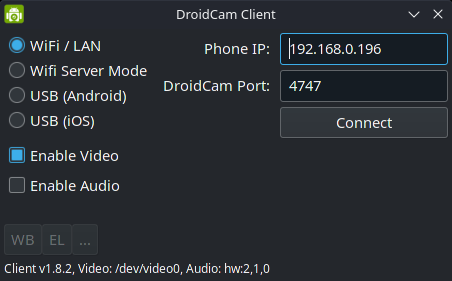

On your smartphone install either [Droidcam](https://play.google.com/store/apps/details?id=com.dev47apps.droidcam) or [DroidcamX](https://play.google.com/store/apps/details?id=com.dev47apps.droidcamx)

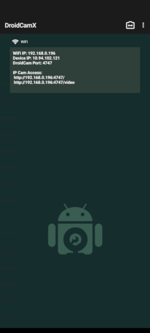

Enter the ip address shown on the smartphone in the Droidcam client on the Steam Deck and connect. The webcam is now ready.

Each update of SteamOS will reset the droidcam install but you can reinstall it quickly by doing:

```sh
sudo steamos-readonly disable
sudo pacman-key --init
sudo pacman-key --populate archlinux
sudo pacman-key --populate holo
sudo pacman -Sy --noconfirm --needed linux-neptune-headers libappindicator-gtk3
sudo pacman -U --noconfirm "$myroot"/home/deck/droidcam/*.pkg.tar.zst
sudo steamos-readonly enable
```

## Android via Waydroid

Launching Android apps is possible using [Waydroid](https://wiki.archlinux.org/title/Waydroid).

Here's a guide on how to get it up and running on the Steam Deck.

**First follow [Create a SteamOS/Arch development root in your home folder](#create-a-steamosarch-development-root-in-your-home-folder) and set up a development ready rootfs.**

Enter the development root:
```sh
bwrap --bind "$myroot" / --dev /dev --proc /proc --ro-bind /sys /sys --tmpfs /tmp --unshare-all --share-net --ro-bind /etc/resolv.conf /etc/resolv.conf --clearenv fakeroot -i /arch.fakeroot -s /arch.fakeroot -- env HOME=/root USER=root bash
```

Install git and clone anbox-modules-git, waydroid and all their dependencies from the AUR:
```sh
pacman -Sy --noconfirm --asdeps --needed git dkms linux-neptune-headers
su - deck -c 'git clone https://aur.archlinux.org/anbox-modules-dkms-git.git /home/deck/anbox-modules-dkms-git'
# Patch PKGBUILD to comment out a sed that makes it fail to compile on the valve kernel
sed -i 's/\b\(sed\s\+.*#if\s\+1.*binder\.c\s*\)$/#\1/' /home/deck/anbox-modules-dkms-git/PKGBUILD
sed -n 's/\b\(make\)\?depends=(\([^)]\+\))/\2/p' /home/deck/anbox-modules-dkms-git/PKGBUILD | xargs -n 1 pacman -S --noconfirm --asdeps --needed
su - deck -c 'cd /home/deck/anbox-modules-dkms-git ; makepkg'
su - deck -c 'git clone https://aur.archlinux.org/libglibutil.git /home/deck/libglibutil'
sed -n 's/\b\(make\)\?depends=(\([^)]\+\))/\2/p' /home/deck/libglibutil/PKGBUILD | xargs -n 1 pacman -S --noconfirm --asdeps --needed
su - deck -c 'cd /home/deck/libglibutil ; makepkg'
pacman -U --noconfirm --needed --asdeps /home/deck/libglibutil/*.pkg.tar.zst
su - deck -c 'git clone https://aur.archlinux.org/libgbinder.git /home/deck/libgbinder'
sed -n 's/\b\(make\)\?depends=(\([^)]\+\))/\2/p' /home/deck/libgbinder/PKGBUILD | xargs -n 1 pacman -S --noconfirm --asdeps --needed
su - deck -c 'cd /home/deck/libgbinder ; makepkg'
pacman -U --noconfirm --needed --asdeps /home/deck/libgbinder/*.pkg.tar.zst
su - deck -c 'git clone https://aur.archlinux.org/python-gbinder.git /home/deck/python-gbinder'
sed -n 's/\b\(make\)\?depends=(\([^)]\+\))/\2/p' /home/deck/python-gbinder/PKGBUILD | xargs -n 1 pacman -S --noconfirm --asdeps --needed
su - deck -c 'cd /home/deck/python-gbinder ; makepkg'
pacman -U --noconfirm --needed --asdeps /home/deck/python-gbinder/*.pkg.tar.zst
su - deck -c 'git clone https://aur.archlinux.org/waydroid.git /home/deck/waydroid'
sed -n 's/\b\(make\)\?depends=(\([^)]\+\))/\2/p' /home/deck/waydroid/PKGBUILD | xargs -n 1 pacman -S --noconfirm --asdeps --needed
su - deck -c 'cd /home/deck/waydroid ; makepkg'
su - deck -c 'git clone https://aur.archlinux.org/python-pyclip.git /home/deck/python-pyclip'
sed -n 's/\b\(make\)\?depends=(\([^)]\+\))/\2/p' /home/deck/python-pyclip/PKGBUILD | xargs -n 1 pacman -S --noconfirm --asdeps --needed
su - deck -c 'cd /home/deck/python-pyclip ; makepkg'
mv /home/deck/libglibutil/*.pkg.tar.zst /home/deck/libgbinder/*.pkg.tar.zst /home/deck/python-gbinder/*.pkg.tar.zst /home/deck/python-pyclip/*.pkg.tar.zst /home/deck/waydroid/
```

Exit the dev environment with `exit`.

In the real rootfs install the anbox modules:
```sh
sudo steamos-readonly disable
sudo pacman-key --init
sudo pacman-key --populate archlinux
sudo pacman-key --populate holo
sudo pacman -Sy --noconfirm --needed linux-neptune-headers libappindicator-gtk3
sudo pacman -U --noconfirm "$myroot"/home/deck/anbox-modules-dkms-git/*.pkg.tar.zst
sudo pacman -U --noconfirm --asdeps "$myroot"/home/deck/waydroid/*.pkg.tar.zst
sudo pacman -D --asexplicit waydroid
sudo pacman -S --needed --noconfirm weston
sudo steamos-readonly enable
```

Load the modules:
```sh
xargs -a /usr/lib/modules-load.d/anbox-modules.conf -n 1 sudo modprobe
```

Offload the waydroid folder onto the home partition:
```sh
sudo cp -a /usr/lib/systemd/system/var-lib-docker.mount /etc/systemd/system/var-lib-waydroid.mount
sudo sed -i 's|/var/lib/docker|/var/lib/waydroid|g' /etc/systemd/system/var-lib-waydroid.mount
sudo systemctl daemon-reload
sudo systemctl enable --now var-lib-waydroid.mount
```

It may be needed to add `psi=1` to the kernel command line (needs more testing)
```sh
sudo mount /dev/disk/by-partsets/self/efi /mnt
sudo sed -i 's/\b\(steamenv_boot\s\+.*\)$/\1 psi=1/g' /mnt/EFI/steamos/grub.cfg
sudo umount /mnt
```
Reboot.

Initialize waydroid by downloading the latest image:
```sh
sudo waydroid init -s GAPPS -f
```

Start the service:
```sh
sudo systemctl start waydroid-container.service
```

Make waydroid folder writable for everyone:
```sh
sudo chmod g+w,o+w /var/lib/waydroid
```

You'll need to disable hardware acceleration for it to work currently. Edit `/var/lib/waydroid/waydroid_base.prop`:
```ini
ro.hardware.gralloc=default
ro.hardware.egl=swiftshader
```

Launch `weston`, it will offer a little sandboxed wayland envrironment.

Open a terminal by clicking on the terminal icon in the upper left corner and set the XDG session:

```sh
export XDG_SESSION_TYPE=wayland
```

Launch the waydroid session and wait until you get `Android with user 0 is ready`:
```sh
waydroid session start
```

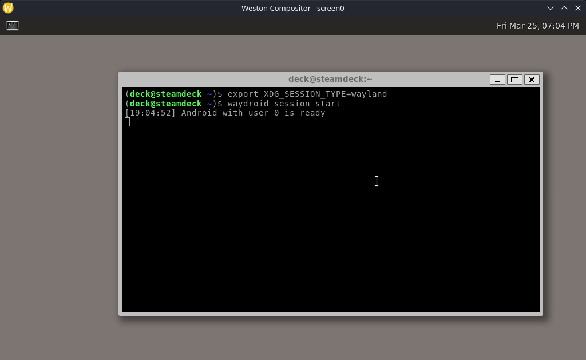

In another terminal in `weston` launch:
```sh
waydroid show-full-ui
```

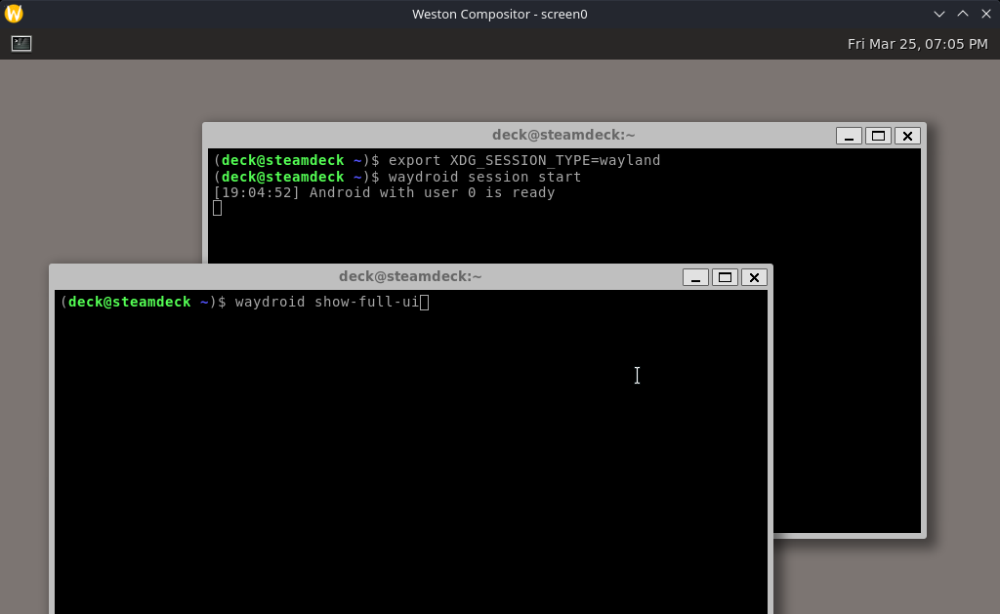

At this point you should see the android home screen.

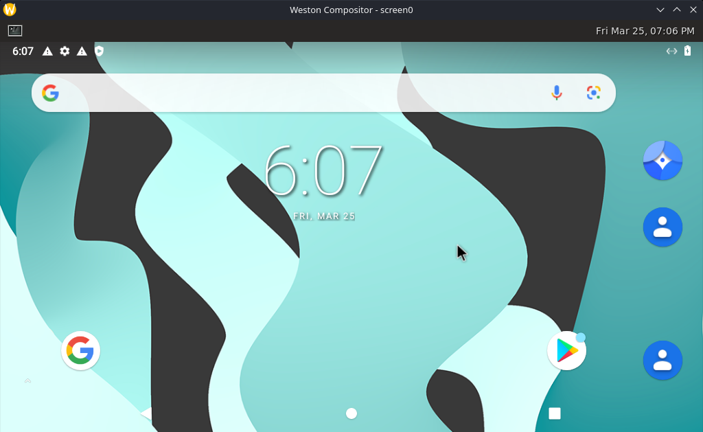

**WARNING! Attempting to access the system settings currently freezes the Steam Deck and it eventually reboots.**

## Convert the home partition to Btrfs

Converting the `ext4` formatted `/home` partition to `btrfs` can bring many advantages like transparent compression, instant snapshotting, deduplication, efficient backups, etc...

- https://gitlab.com/popsulfr/steamos-btrfs

It also adds support to mount `btrfs` and `f2fs` formatted sd cards.

I've been daily driving it, switching branches and updating the system frequently in order to write up the guides around the Steam Deck all without issues.

## Gamescope fps limiter not working on flatpaks

The gamescope integrated fps limiter might now work as expected on flatpak apps (yuzu, bottles...).

Using `mangohud` and setting `vsync=0` (`FIFO_RELAXED_KHR`) seems to do the trick.

Install the `mangohud` flatpak:

```sh
flatpak install org.freedesktop.Platform.VulkanLayer.MangoHud
```

## Flatseal

With **flatseal** (install via Discover or `flatpak install com.github.tchx84.Flatseal`) you can set persistent environment variables.

Select your flatpak in `flatseal` and under `Environment` set the following environment variables:

```
MANGOHUD=1
MANGOHUD_CONFIG=no_display,vsync=0
```

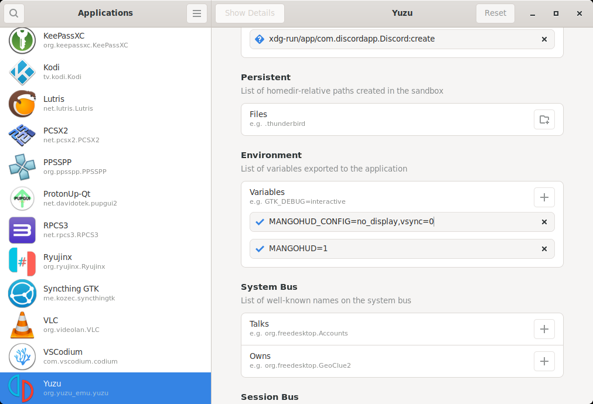

## Bottles

If you are using [Bottles](https://usebottles.com/), you can set per bottle environment variables.

Go into your `bottle` and under `Preferences > Environment variables` add the variables:

```
MANGOHUD=1
MANGOHUD_CONFIG=no_display,vsync=0
```

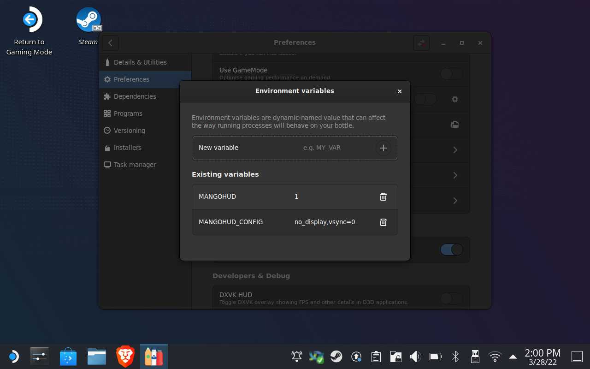


## Toggle internal display via hotkeys

Sometimes it is useful to be able to quickly toggle the internal display in desktop mode. You can use the following script to toggle the Steam Deck's display:

```bash
#!/bin/bash

# Count of lines returned by xrandr --listactivemonitors
active=$(xrandr --listactivemonitors | grep -w 'eDP' -c)
# Screen resolution
resolution=800x1280
# Position relative to your external monitor(s)
# KDEs display settings can be used to get the correct position
position=626x1440
# Refresh rate
refreshrate=60

if (($active == 1)); then
    echo "Turning OFF internal monitor!"
    xrandr --output eDP --off
else
    echo "Turning ON internal monitor!"
    xrandr --output eDP --mode $resolution --rate $refreshrate --pos $position --rotate right
fi
```
Make sure to set the position to match your screen setup.

To define a shortcut open System Settings and navigate to the "Shortcuts" section as seen on the screenshot below. Set the action and the trigger and you're good to go.

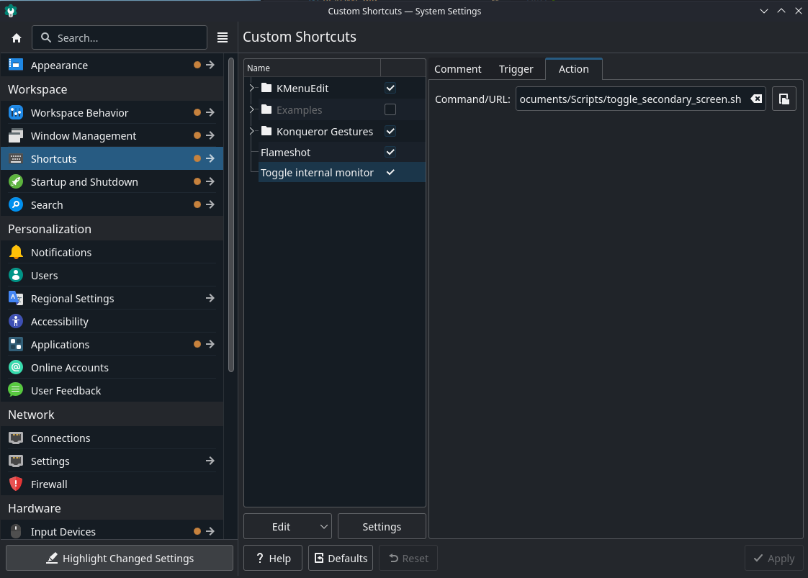